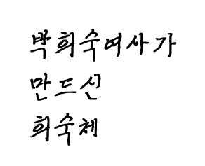
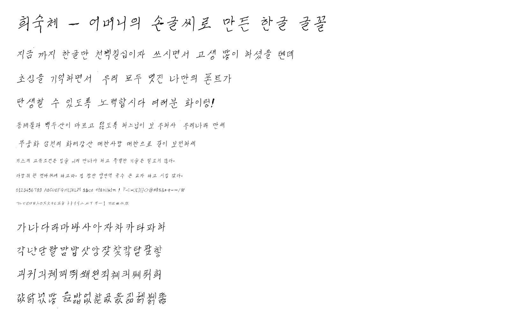
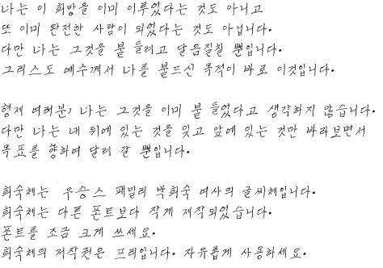

<p align="center">
  
</p>

# 희숙체 (Heesookche)

희숙 님이 견본지 71장에 손으로 쓴 글씨를 그대로 옮긴 글꼴입니다.
한글 11,172자 전부와 자모 51자, 영문·숫자·기호 94자가 들어 있습니다.

| | |
|---|---|
| 만든 날짜 | 2026-07-27 |
| 글자 수 | 11,317자 |
| 굵기 | Regular (1종) |
| 형식 | TTF, OTF |

> **쓰실 때 한 가지** — 희숙체는 다른 글꼴보다 글자를 작게 만들었습니다. 크기를 한두 단계 크게 잡으시면 보기 좋습니다.

## 견본





## 담긴 파일

```
Windows/   윈도우용 (희숙체.ttf, 희숙체.otf)
Android/   안드로이드용 (Heesookche-Regular.ttf)
iOS/       아이폰·아이패드용 (희숙체.mobileconfig, ttf, otf)
견본.png   글꼴 견본
free.jpg   본문 견본
LICENSE.txt  사용 허락서
```

세 폴더의 글자 모양은 완전히 같습니다. 설치 방법만 다릅니다.
자세한 내용은 각 폴더의 `설치방법.txt` 를 보세요.

## 설치

### 윈도우

1. `Windows/희숙체.ttf` 를 마우스 오른쪽 버튼으로 누릅니다.
2. **설치** 를 고릅니다. 컴퓨터를 쓰는 모든 사람이 쓰게 하려면 **모든 사용자용으로 설치** 를 고릅니다(관리자 권한 필요).
3. 한글, 워드, 파워포인트 등에서 글꼴 목록의 "희숙체" 를 고르면 됩니다.

`희숙체.otf` 는 같은 글꼴의 다른 형식입니다. 둘 중 하나만 설치하세요. 윈도우에서는 `.ttf` 를 권합니다. 인쇄·PDF 용으로는 `.otf` 가 파일이 조금 작습니다.

지우려면: 설정 → 개인 설정 → 글꼴 → 희숙체 → **제거**

### 아이폰 · 아이패드

앱 없이 프로필로 설치하는 방법입니다.

1. `iOS/희숙체.mobileconfig` 파일을 아이폰으로 보냅니다(에어드롭·카카오톡·메일·아이클라우드 어느 쪽이든 좋습니다).
2. 파일 앱에서 그 파일을 눌러 엽니다.
3. 설정 앱을 열면 맨 위에 **프로필이 다운로드됨** 이 보입니다. 눌러서 **설치**. 암호를 묻고 "확인되지 않음" 이라고 나와도 **설치** 를 계속 누르면 됩니다(애플에 돈을 내고 서명한 프로필이 아니라서 그렇게 표시됩니다).
4. Pages, Keynote, 워드, 한글 등에서 글꼴 목록의 "희숙체" 를 고릅니다.

App Store 의 AnyFont 또는 iFont 로 `Heesookche-Regular.ttf` 를 열어 설치해도 같습니다.

지우려면: 설정 → 일반 → VPN 및 기기 관리 → 희숙체 글꼴 → **프로필 제거**

> 아이폰·아이패드의 시스템 글꼴(홈 화면, 메시지 등)은 애플이 바꾸지 못하게 막아 두었습니다. 문서·발표 자료를 만드는 앱 안에서 쓸 수 있습니다.

### 안드로이드

기종마다 방법이 다릅니다.

**가장 쉬운 방법 — 문서 앱에서 쓰기**
한컴오피스, 폴라리스 오피스 등은 앱 안에서 글꼴 파일을 직접 불러올 수 있습니다. `Heesookche-Regular.ttf` 를 휴대폰의 **다운로드** 폴더에 넣고, 앱의 글꼴 설정에서 **사용자 글꼴 추가** 로 불러오세요.

**휴대폰 전체에 적용**

1. Play 스토어에서 iFont 또는 zFont 3 을 설치합니다.
2. `Heesookche-Regular.ttf` 를 휴대폰 **다운로드** 폴더에 넣습니다.
3. 앱에서 **내 글꼴** → 파일을 고르고 **설치** 를 누릅니다.
4. 삼성 갤럭시는 설정 → 디스플레이 → 글꼴 크기와 스타일 에서 희숙체를 고릅니다.

기종·안드로이드 버전에 따라 전체 적용이 막혀 있을 수 있습니다.

**앱을 만드는 경우**
`app/src/main/res/font/` 또는 `assets/fonts/` 에 ttf 를 넣고 `android:fontFamily` 로 지정하면 됩니다. 만든 앱은 상업용이라도 자유롭게 배포하셔도 됩니다.

## 만든 방법

스캔한 견본지에서 글자를 한 칸씩 잘라내(10,998자) 외곽선을 땄습니다.
견본지 8·9쪽이 없어서 빠진 312자와 그 밖의 7자는 같은 글씨의 다른 글자에서 첫소리와 나머지를 가져다 붙여 만들었습니다(합계 319자).
줄마다 조금씩 다른 높이는 고르게 폈고, 글자 하나하나의 크기와 기울기는 쓴 그대로 두었습니다.

## 라이선스

누구나 공짜로 쓰실 수 있습니다. **상업적 이용도 자유입니다.** 다만 **글꼴 파일을 고치는 것만 안 됩니다.**
Copyright (c) 2026 weinovel &lt;contact@weinovel.com&gt;

| | |
|---|---|
| 개인·회사·단체가 설치해서 쓰기 | ✅ |
| 광고·간판·포장·책·영상·상품 등 영리 목적 | ✅ (허락도 비용도 필요 없습니다) |
| 이 글꼴로 만든 문서·그림·발표 자료를 팔거나 나눠 주기 | ✅ (결과물은 제약 없습니다) |
| 글꼴이 들어간 물건·프로그램·앱을 팔기 | ✅ |
| 글꼴 파일 그대로 나눠 주기 · 인터넷에 올리기 · 앱에 넣어 배포 | ✅ (`LICENSE.txt` 를 함께 넣어 주세요) |
| 글꼴 파일 고치기 · 형식 바꾸기 · 파생 글꼴 만들기 | ❌ |
| 글꼴 파일 자체를 상품으로 팔기 (재판매) | ❌ |
| 자기가 만든 글꼴이라고 하기 | ❌ |

전문은 `LICENSE.txt` 를 보세요.
